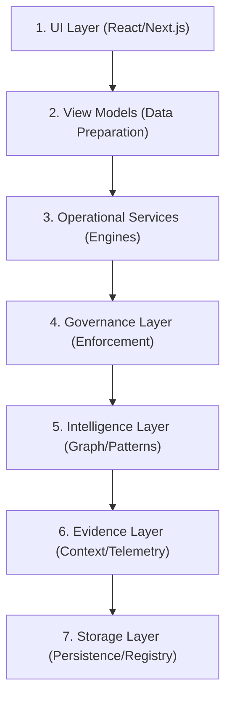

# StudioOS Operational Architecture

This document defines the hierarchical architecture of NStep StudioOS, ensuring a clean separation of concerns between visual representation, operational logic, governance, and intelligence.

## Operational Stack

---

### 1. UI Layer
*   **Location**: `apps/nstep-dashboard/src/app/` & `src/components/dashboard/routes/`
*   **Responsibility**: Rendering the executive surface. Focus is strictly on visual state, layout, and user interaction.
*   **Constraint**: No direct business logic or service instantiation.

### 2. View Models
*   **Location**: `apps/nstep-dashboard/src/lib/dashboard/view-models/`
*   **Responsibility**: Transforming raw service data into UI-ready contracts. Handles formatting, severity mapping, and localization.
*   **Constraint**: Stateless. Pure functions preferred.

### 3. Operational Services
*   **Location**: `apps/nstep-dashboard/src/lib/studioos/`
*   **Responsibility**: The "Engines" of StudioOS. Manages incidents, timelines, execution workflows, and health monitoring.
*   **Constraint**: Coordinates between Governance and Storage.

### 4. Governance Layer
*   **Location**: `governance-service.ts`, `verification-engine.ts`, `protected-file-monitor.ts`
*   **Responsibility**: Policy enforcement, audit logging, and integrity verification. Ensures no operation bypasses studio safety rules.
*   **Constraint**: All execution workflows must pass through a governance gate.

### 5. Intelligence Layer
*   **Location**: `knowledge-graph-service.ts`, `architecture-map-service.ts`, `pattern-analysis-service.ts`
*   **Responsibility**: High-level reasoning. Maps studio topology, detects recurring failure patterns, and provides stability forecasts.
*   **Constraint**: Advisory only. Matterhorn uses this layer to ground its reasoning.

### 6. Evidence Layer
*   **Location**: `matterhorn-client.ts`, `timeline-service.ts`, `snapshots/`
*   **Responsibility**: Providing grounding context (evidence) for AI reasoning and human audits. 
*   **Constraint**: Must be immutable and trace-linked (causality).

### 7. Storage Layer
*   **Location**: `operational-memory-service.ts`, `app-registry.ts`, `repo-snapshot.json`
*   **Responsibility**: Persistence. Long-term memory, registry state, and operational history.
*   **Constraint**: Single source of truth for the studio state.

---

## Data Flow (North-South)
1.  **Request**: UI → View Model → Operational Service → Governance (Check) → Execution.
2.  **Telemetry**: Storage → Intelligence → Evidence → Operational Service → View Model → UI.
