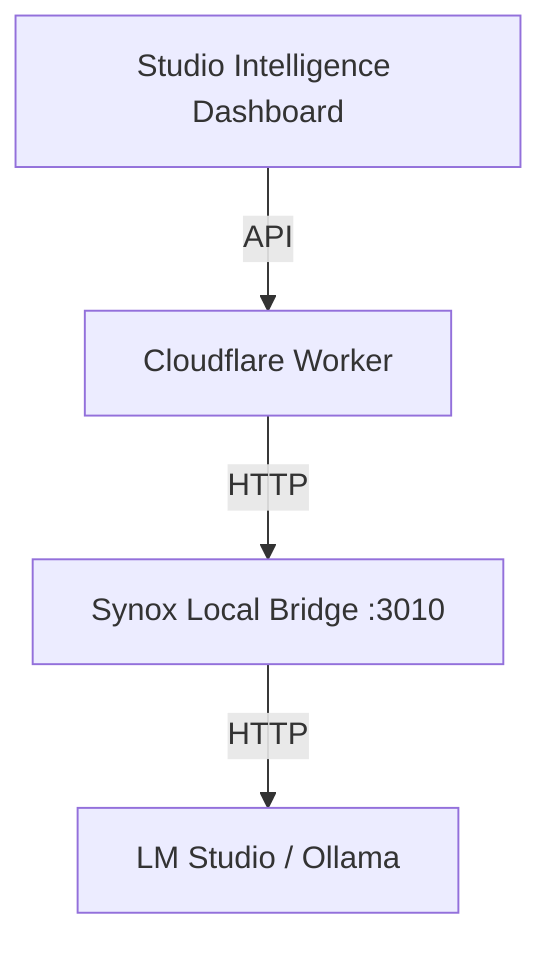

# Synox Local Reasoning Bridge

The **Synox Local Reasoning Bridge** is a local-only service that connects **Matterhorn** (the NStep AI agent) and **Studio Intelligence** to local LLM providers like **LM Studio** and **Ollama**.

## Architecture



## Security & Safety

- **Localhost Only**: The bridge binds to `127.0.0.1`. It is not accessible from the public internet.
- **Advisory Mode**: All requests to the bridge are flagged as `advisoryOnly: true`. 
- **Safety Prompt**: Every request is wrapped in a system prompt that prohibits command execution, file modification, or deployment actions.
- **Data Privacy**: Grounded context is processed locally on the admin's machine.

## Setup Instructions

### 1. Start your LLM Provider

#### LM Studio (Recommended)
1. Download a model (e.g., `qwen2.5-coder-14b-instruct`).
2. Go to the "Local Server" tab.
3. Start the server on port `1234`.

#### Ollama
1. Install Ollama.
2. Run `ollama run qwen2.5-coder:14b` (or your preferred model).
3. The server runs on port `11434` by default.

### 2. Start the Synox Bridge

```bash
cd apps/synox-local-bridge
npm install
npm start
```

### 3. Verify in Studio Intelligence

- Open the **Studio Intelligence** dashboard.
- Check the **Synox Reasoning Bridge** card in the left sidebar.
- It should show "Online" with your active provider and model.

## API Specification

### `GET /health`
Returns the status of the bridge and the connected provider.

### `POST /reason`
Generates a grounded advisory response.

**Request Body**:
```json
{
  "mode": "executive",
  "question": "What is the status of the project?",
  "context": {
    "summary": "Full project context...",
    "sources": ["projects", "repo_snapshots"]
  },
  "safety": { "advisoryOnly": true }
}
```

## Troubleshooting

- **"Bridge Offline"**: Ensure the bridge process is running in your terminal.
- **"Provider Offline"**: Ensure LM Studio/Ollama is running and the "Local Server" is started.
- **High Latency**: Local models can be slow depending on hardware. Consider using smaller models (e.g., 7B or 8B) if response time exceeds 10 seconds.
