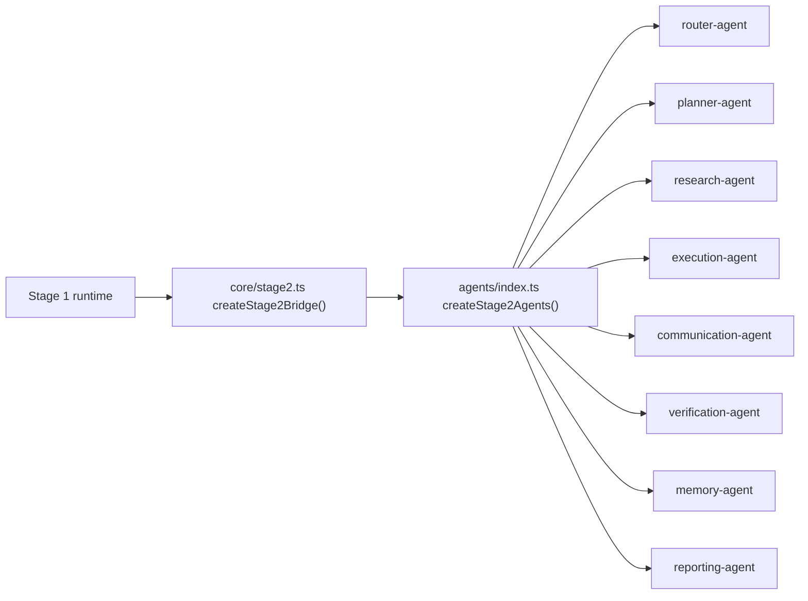

# NStepOS Stage 2 Internal Agents

Stage 2 adds the internal execution layer for NStepOS without adding any product-specific workflows. The agents are thin, reusable wrappers that are bound to the Stage 1 runtime through an explicit bridge.

## File Map

- `packages/nstep-os/src/core/stage2-models.ts`
  - Shared Stage 2 contracts, permissions, responsibilities, research/message I/O, and the runtime bridge type.
- `packages/nstep-os/src/core/stage2.ts`
  - Stage 2 bridge factory that connects the internal agents back to Stage 1 primitives.
- `packages/nstep-os/src/agents/index.ts`
  - Agent registry/factory that instantiates the internal agent set.
- `packages/nstep-os/src/agents/router-agent/index.ts`
  - Router Agent scaffold.
- `packages/nstep-os/src/agents/planner-agent/index.ts`
  - Planner Agent scaffold.
- `packages/nstep-os/src/agents/research-agent/index.ts`
  - Research Agent scaffold.
- `packages/nstep-os/src/agents/execution-agent/index.ts`
  - Execution Agent scaffold.
- `packages/nstep-os/src/agents/communication-agent/index.ts`
  - Communication Agent scaffold.
- `packages/nstep-os/src/agents/verification-agent/index.ts`
  - Verification Agent scaffold.
- `packages/nstep-os/src/agents/memory-agent/index.ts`
  - Memory Agent scaffold.
- `packages/nstep-os/src/agents/reporting-agent/index.ts`
  - Reporting Agent scaffold.
- `packages/nstep-os/src/schemas/agents.ts`
  - JSON-schema style definitions for agent metadata and Stage 2 research/message payloads.
- `packages/nstep-os/src/core/runtime.ts`
  - Stage 1 runtime composition point that builds the bridge and mounts the Stage 2 registry.

## Runtime Connection

The connection between Stage 1 and Stage 2 is intentionally explicit:

1. `core/runtime.ts` creates the durable stores, tools, logger, and config.
2. `core/stage2.ts` builds a `Stage2Bridge` from Stage 1 primitives such as `intakeGoal`, `routeGoal`, `planGoal`, `executeStep`, `verifyJob`, `createJobMemory`, and `buildWorkflowReport`.
3. `agents/index.ts` receives that bridge and instantiates the internal agents.
4. Each agent delegates to the bridge instead of hard-coding workflow logic or product behavior.

## Agent Responsibilities

- Router Agent
  - Classifies a goal into a route, lane, and risk posture.
  - Permissions: `route`, `classify`
- Planner Agent
  - Turns the routed goal into a step graph with dependencies and approval markers.
  - Permissions: `plan`
- Research Agent
  - Prepares reusable research requests and source lists.
  - Permissions: `research`
  - External tool use is allowed only through the runtime boundary.
- Execution Agent
  - Delegates step execution to the Stage 1 contract and preserves durable state boundaries.
  - Permissions: `job`, `execute`
- Communication Agent
  - Drafts editable, business-safe outbound copy.
  - Permissions: `message`, `compose`
- Verification Agent
  - Confirms outcomes, failures, and escalation conditions.
  - Permissions: `job`, `verify`
- Memory Agent
  - Stores reusable patterns, preferences, and safety rules.
  - Permissions: `memory`, `remember`
- Reporting Agent
  - Produces job summaries and dashboard snapshots.
  - Permissions: `report`

## Notes

- No product-specific workflow logic is embedded in the agent layer.
- Stage 2 agents are reusable across Lead Recovery, NexusBuild, ProvLy, and future products.
- The job engine remains the Stage 1 source of truth for durable state, retries, approvals, and execution lifecycle.
