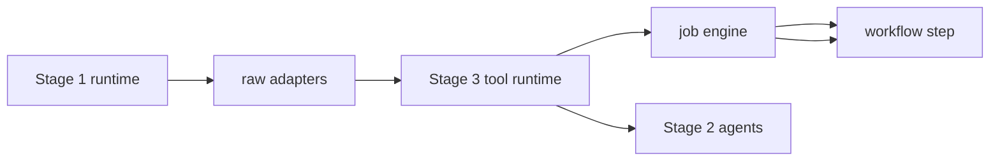

# NStepOS Stage 3 Tool Adapter Layer

Stage 3 turns the existing adapter files into a scoped, permission-aware tool layer that the Stage 1 job engine and Stage 2 agents can use without introducing product business logic.

## File Map

- `packages/nstep-os/src/core/stage3-models.ts`
  - Shared tool contracts, scope, permissions, descriptors, invocation records, and retry policy.
- `packages/nstep-os/src/core/stage3.ts`
  - Barrel that exposes the Stage 3 surface to the rest of the package.
- `packages/nstep-os/src/tools/policy.ts`
  - Permission evaluator, retry helpers, and permission error type.
- `packages/nstep-os/src/tools/runtime.ts`
  - Scoped runtime wrapper that instruments browser, SMS, email, database, API, scraping, scheduler, and Redis adapters with retries and logging.
- `packages/nstep-os/src/tools/database/runtime.ts`
  - Generic database adapter scaffold with Postgres/Supabase/file fallback behavior.
- `packages/nstep-os/src/tools/index.ts`
  - Tool-layer barrel export.
- `packages/nstep-os/src/schemas/tools.ts`
  - Validation-style schemas for tool scope, permissions, descriptors, invocation records, and runtime snapshots.
- `packages/nstep-os/src/core/runtime.ts`
  - Runtime composition point that builds the Stage 3 tool runtime and passes it into the job engine.
- `packages/nstep-os/src/jobs/job-engine.ts`
  - Binds a scoped tool session to each job before workflow execution.

## How It Connects

1. `core/runtime.ts` creates the raw adapters for browser, SMS, email, database, API, scraping, scheduler, and Redis.
2. `tools/runtime.ts` wraps those adapters in a permission-aware runtime with retries and structured invocation logging.
3. `job-engine.ts` scopes the tools to the active job before handing them to workflow execution.
4. Stage 2 agents can also request a scoped runtime session later through the same `scope()` method.

## Tool Responsibilities

- Browser
  - External page visit and content extraction.
  - Retryable, approval-aware, logged.
- SMS
  - Twilio-backed send and delivery verification.
  - Retryable, approval-aware, logged.
- Email
  - Webhook-backed or mock send.
  - Retryable, approval-aware, logged.
- Database
  - Generic query/execute scaffold with Postgres, Supabase, or file fallback.
  - Scoped and logged.
- API
  - Generic HTTP GET/POST/request wrapper.
  - Retryable, approval-aware, logged.
- Scraping
  - HTML scrape helper for research flows.
- Scheduler
  - Delayed job scheduling and cancellation.
- Redis
  - Lightweight cache and queue coordination.

## Integration Notes

- The tool runtime intentionally preserves the existing method signatures so current workflow code keeps compiling.
- Scoped access is available through `tools.scope({ jobId, agentId, riskLevel, approvalStatus })`.
- Permission gating is enforced through the tool policy when a scope is present.
- Invocation records are collected in memory for future audit or dashboard rendering.
