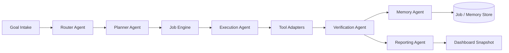

# NStepOS

NStepOS is the orchestration runtime for NStep's goal-driven autonomous work. It is the visible control plane that routes goals, plans work, executes tasks, verifies outcomes, persists memory, and surfaces audit-ready reports.

NSCore is the internal intelligence layer implemented inside this package. It owns routing, planning, verification, memory selection, and policy decisions. NStepOS wraps those internals in durable job execution, storage, and API surfaces.

## What this package provides

- structured goal intake
- workflow routing and planning
- multi-agent execution contracts
- internal and external tool adapters
- durable job state and step state
- memory persistence
- approval gating and audit logs
- reporting and dashboard snapshots
- the first production-ready Lead Recovery workflow

## Staging Environment

Set these variables in staging and production:

- `TWILIO_ACCOUNT_SID`, `TWILIO_AUTH_TOKEN`, `TWILIO_FROM_NUMBER`
- `SUPABASE_DB_URL` or `DATABASE_URL`
- `REDIS_URL`
- `NSTEP_OS_INTERNAL_TOKEN` for trusted dashboard-to-backend requests

The backend now rejects public routes unless they are explicitly public health or Twilio webhook endpoints.

## Architecture



## Folder structure

```text
src/
  core/
    config.ts
    logger.ts
    persistence.ts
    runtime.ts
    types.ts
    validation.ts
  intake/
  router/
  planner/
  executor/
  verifier/
  memory/
  reporting/
  agents/
    router-agent/
    planner-agent/
    research-agent/
    execution-agent/
    communication-agent/
    verification-agent/
    memory-agent/
    reporting-agent/
  tools/
    browser/
    sms/
    email/
    database/
    api/
    scraping/
    scheduler/
  jobs/
  policies/
  schemas/
  memory-store/
  workflows/
    lead-recovery/
    nexusbuild/
    provly/
    neurormoves/
  phase-1/
  dashboard/
  server.ts
```

## Phase 1 surface

Phase 1 is the staged foundation. It includes only the goal boundary and the orchestration core:

- goal intake
- router
- planner
- job engine

The public starter for this stage is `createPhase1Surface()`.

```ts
import { createPhase1Surface } from "@nstep/os";

const phase1 = createPhase1Surface();
```

## Lead Recovery workflow

The first live workflow is Lead Recovery:

1. detect a missed call event
2. normalize the incoming call payload
3. retrieve caller history and lead metadata
4. check suppression rules and contact timing
5. classify whether the lead can be contacted safely
6. generate a short, business-safe SMS variant
7. validate tone and policy safety
8. send SMS through the SMS adapter
9. verify delivery or failure state
10. log the interaction and lead status in the database adapter
11. store a reusable memory entry
12. return a dashboard-visible summary

The message layer supports common business scenarios:

- generic missed-call callback
- after-hours response
- service inquiry acknowledgment
- quote follow-up opener
- appointment callback message

## Run locally

1. `cd packages/nstep-os`
2. `npm install`
3. `npm run check`
4. `npm run start`

The server defaults to `http://127.0.0.1:3060`.

## Environment variables

- `NSTEP_OS_PORT` - server port
- `NSTEP_OS_DATA_DIR` - durable JSON storage directory
- `NSTEP_OS_PROVIDER_MODE` - `mock`, `openai`, or `gemini`
- `NSTEP_OS_OPENAI_API_KEY`
- `NSTEP_OS_OPENAI_MODEL`
- `NSTEP_OS_GEMINI_API_KEY`
- `NSTEP_OS_GEMINI_MODEL`
- `TWILIO_ACCOUNT_SID`
- `TWILIO_AUTH_TOKEN`
- `TWILIO_FROM_NUMBER`
- `DATABASE_URL`
- `REDIS_URL`

## Twilio setup

- point your missed-call webhook at `POST /v1/webhooks/twilio/missed-call`
- include the Twilio fields `CallSid`, `From`, `To`, `CallStatus`, and `CallDuration`
- set `TWILIO_ACCOUNT_SID`, `TWILIO_AUTH_TOKEN`, and `TWILIO_FROM_NUMBER`
- optionally pass `businessName`, `signature`, `followupTemplate`, and `businessHours` in the webhook payload for tenant-specific behavior
- use `mode=assist` for review-first tenants and `mode=autonomous` for known-safe lead recovery flows

## Build plan

1. finish Phase 1: goal intake, router, planner, and job engine
2. add execution, verifier, memory, and reporting layers as Phase 2
3. ship Lead Recovery end to end with SMS delivery, verification, and memory
4. add NexusBuild, ProvLy, and NeuroMoves workflow definitions
5. wire the admin dashboard to live job and memory snapshots
6. add stronger provider, browser, queue, and database adapters
